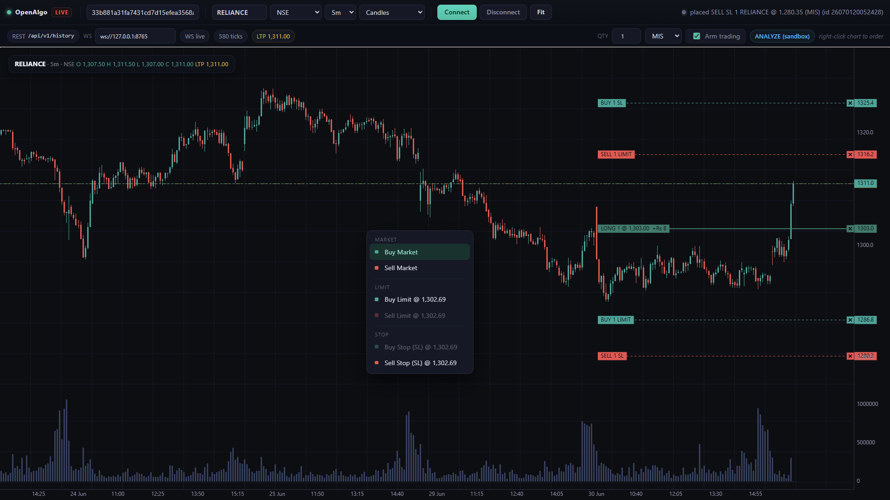
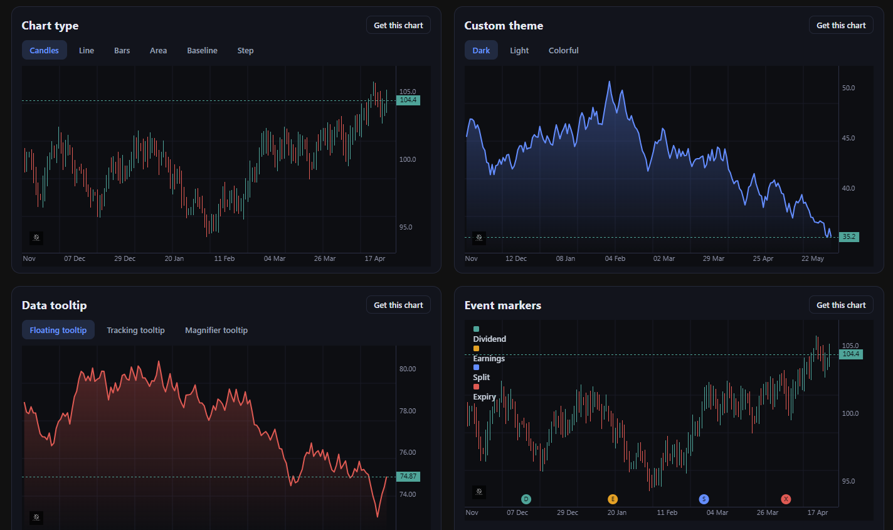
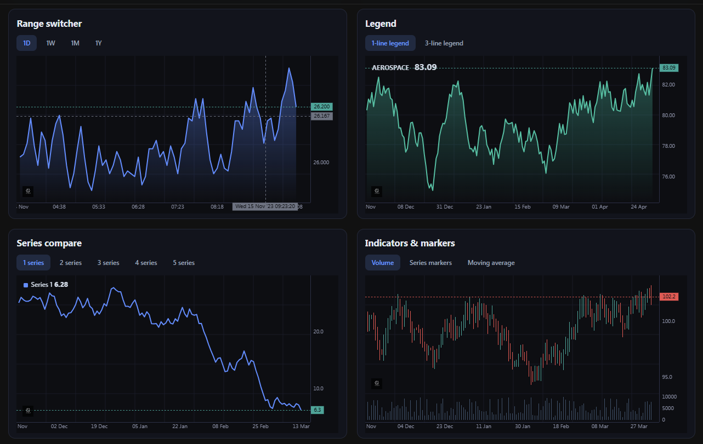
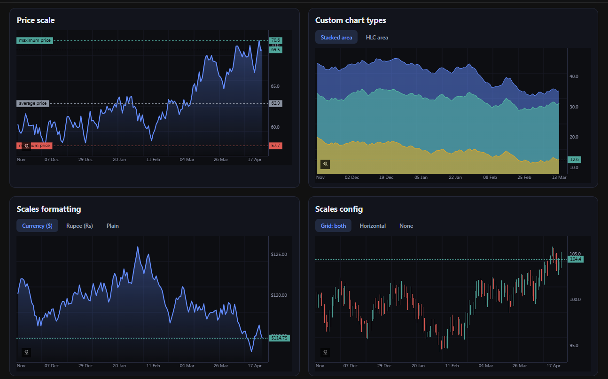
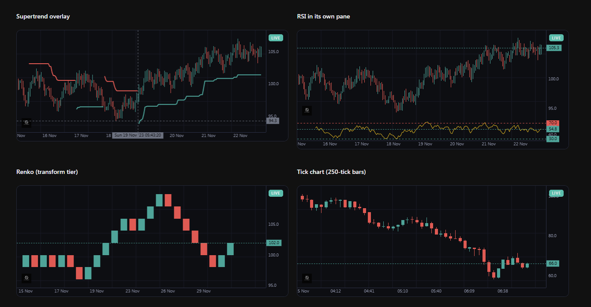

<div align="center">

# OpenAlgo Charts

**A from-scratch, dependency-free HTML5-canvas charting engine for OpenAlgo.**

Professional interactive financial charts, on-chart trading, and live data - in under 40 KB Brotli, with zero runtime dependencies.

[](https://www.npmjs.com/package/openalgo-charts)
[](./LICENSE)
[](./ARCHITECTURE.md)
[](#develop)
[](#principles)

[**Documentation**](https://marketcalls.github.io/openalgo-charts/) &nbsp;·&nbsp; [**Live examples**](https://marketcalls.github.io/openalgo-charts/examples) &nbsp;·&nbsp; [**Getting started**](./docs/getting-started.md) &nbsp;·&nbsp; [**Architecture**](./ARCHITECTURE.md)


</div>

---

## Live OpenAlgo trading terminal

Right-click the chart to place market / limit / stop orders, drag the order and TP/SL bracket lines to modify, and watch live P&amp;L on the position line - all on real OpenAlgo history + WebSocket tick data, with an analyzer (sandbox) mode so nothing goes live until you arm it.

<p align="center">
  
</p>

## Examples gallery

Every chart in the [live gallery](https://marketcalls.github.io/openalgo-charts/examples) is the real library running in your browser - switch tabs, hover the crosshair, drag the order lines. What you see is the code that ran.

<p align="center">
  
  
</p>
<p align="center">
  
  
</p>

## Install

```bash
npm install openalgo-charts
```

```ts
import { createChart, generateBars } from 'openalgo-charts';

const chart = createChart(document.getElementById('chart'));
chart.addSeries('candlestick').setData(generateBars(1700000000, 200, 3600));
```

Loadable tiers - lazy-load only what you use:

| Import | Contents |
|---|---|
| `openalgo-charts` | Base engine + all standard chart types, indicators, primitives, trading overlay |
| `openalgo-charts/trade` | On-chart order/position/bracket tools + DOM ladder |
| `openalgo-charts/transform` | Renko, Range bars, Point &amp; Figure, Kagi, Line Break, Heikin Ashi |
| `openalgo-charts/profile` | Volume Profile, Market Profile (TPO), Footprint, Order flow |

## What's built

- **Chart types:** candles, hollow/volume candles, bars, high-low, line, line+markers, step, area, HLC-area, baseline, columns, histogram.
- **Transforms:** Heikin Ashi, Renko, Range bars, Line Break, Point &amp; Figure, Kagi.
- **Profiles &amp; order flow:** Volume Profile, Market Profile (TPO), Footprint, cumulative delta.
- **Trading:** order/position/bracket lines, live P&amp;L, one-click + drag-to-modify, OCO, validation, analyzer mode, and a depth-of-market ladder (5 to 200 levels).
- **Live + historical** OpenAlgo data (REST history + WebSocket ticks with auto-reconnect), a unified `chart.on(...)` event bus, markers/signals, earnings/dividend/expiry event markers, custom price/time formatters, and EMA/RSI/ATR/Supertrend indicators.

## Documentation

Full docs, the interactive example gallery, and the generated API reference live at:

**https://marketcalls.github.io/openalgo-charts/**

The site is built with Nextra (in [`website/`](./website)) and statically exported to GitHub Pages on every push. Every code sample on a docs page is a *live* chart running the real library, so what you read is what runs. To run the site locally:

```bash
npm run build                               # build the library (dist/) the live demos import
cd website && npm install && npm run dev    # http://localhost:3000/openalgo-charts
```

## Develop

```bash
npm install        # install dev toolchain
npm run typecheck  # strict TypeScript check
npm test           # unit tests (vitest) - 297 across 39 files
npm run build      # Rollup -> dist/ (minified ESM per tier + types)
npm run size       # size-limit (Brotli) against the budget
npm run e2e        # Playwright Chromium smoke tests
npm run verify     # typecheck + test + build + size
```

## Principles

- **Single canvas pipeline** (no SVG, no DOM-per-bar) - small and fast.
- **Gapless time axis by default** - weekends, holidays, and session breaks collapse.
- **Zero runtime dependencies** - nothing is excluded from the size budget.
- **Apache-2.0**, original code.

## Status &amp; limitations

Version **1.0.1 (published)** - all engine build phases are implemented with 297 unit tests, base engine ~24 KB Brotli, full package ~38 KB Brotli (all tiers). The OpenAlgo WS/trade adapters ship and auto-reconnect, but their exact message/endpoint schemas should be verified against your running OpenAlgo build. Overlay and `indexed-to-100` price scales are not yet implemented - see [`ARCHITECTURE.md`](./ARCHITECTURE.md) for the honest deferred list.

## License

[Apache-2.0](./LICENSE). See [`NOTICE`](./NOTICE).
