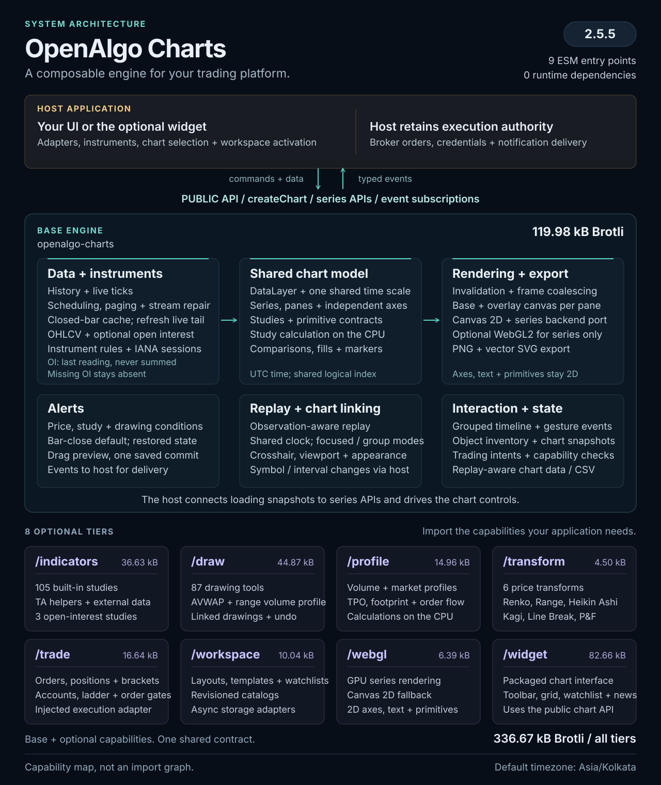
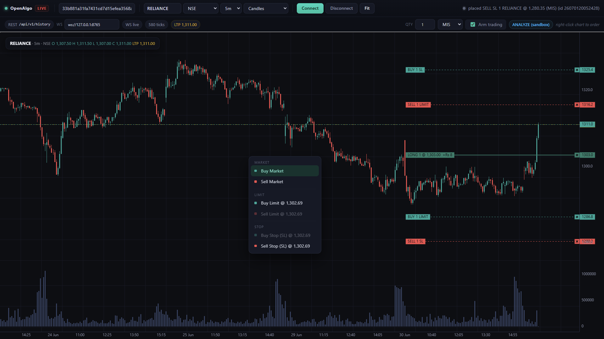
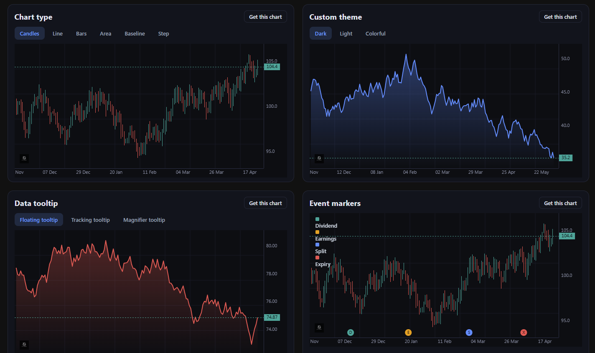
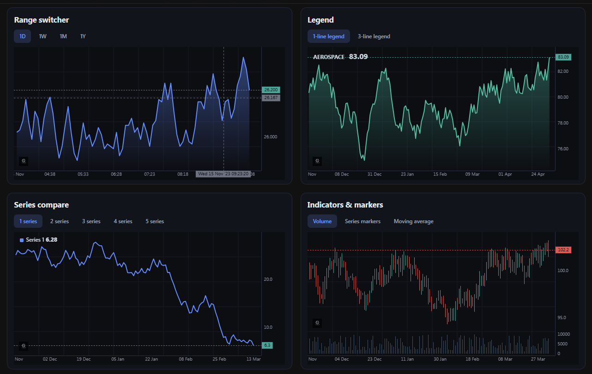
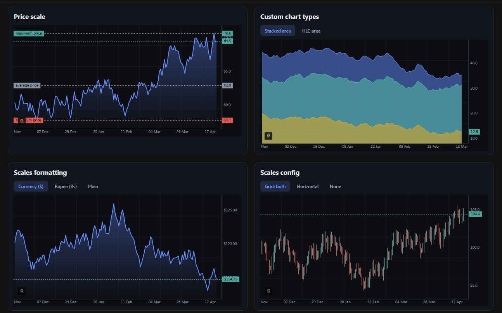
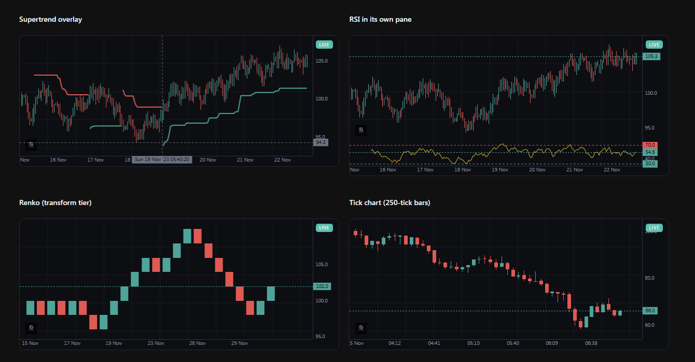
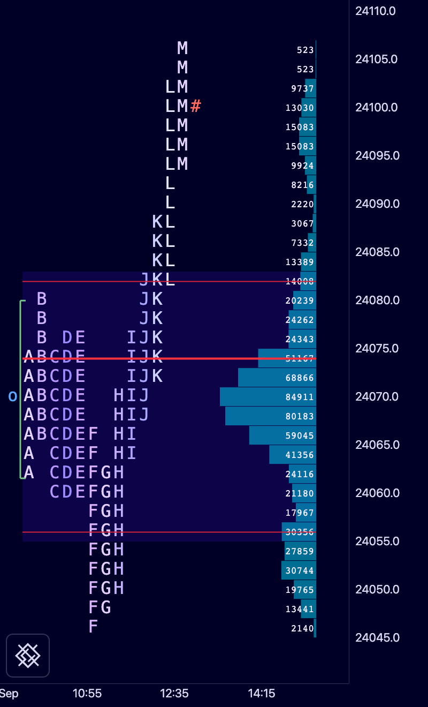
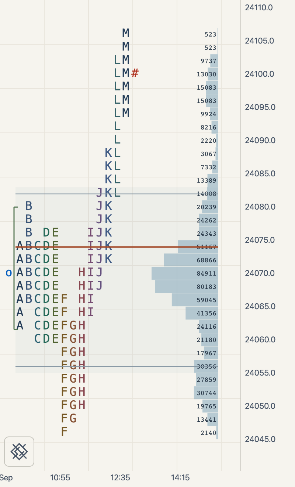

<div align="center">

# OpenAlgo Charts

**A JavaScript and TypeScript library for financial charts.**

Show market prices, add indicators and drawings, set alerts, and replay historical
data in your web app. Use your own data and interface, or add the optional widget
for a toolbar, menus and dialogs. Built for OpenAlgo and custom trading apps,
with no runtime dependencies.

[](https://www.npmjs.com/package/openalgo-charts)
[](./LICENSE)
[](https://www.npmjs.com/package/openalgo-charts)
[](#develop)
[](#principles)

[**Documentation**](https://marketcalls.github.io/openalgo-charts/) &nbsp;·&nbsp; [**Live examples**](https://marketcalls.github.io/openalgo-charts/examples) &nbsp;·&nbsp; [**Getting started**](./docs/getting-started.md) &nbsp;·&nbsp; [**Migrating to 2.0**](./docs/migrating-to-2.md) &nbsp;·&nbsp; [**Architecture**](./ARCHITECTURE.md)

</div>

## Install

```bash
npm install openalgo-charts
```

Current version: **2.5.5**. Watchlists, news and account panels, a movable price pane, drawings pinned to the screen, price tick bands, and studies that recover after a missing bar.
See the [changelog](./CHANGELOG.md) for release notes.

## Quick start

Give the chart a container with a height:

```html
<div id="chart" style="width:100%;height:420px"></div>
```

Then create a chart and supply its data:

```ts
import { createChart, generateBars } from 'openalgo-charts';

const container = document.getElementById('chart');
if (!container) throw new Error('Chart container not found');

const chart = createChart(container);
chart.addSeries('candlestick').setData(generateBars(1700000000, 200, 3600));
chart.fitContent();
```

`generateBars` supplies sample prices. Replace them with data from your feed.
Bar timestamps use UTC seconds. See [getting started](./docs/getting-started.md)
for setup, [data feeds](https://marketcalls.github.io/openalgo-charts/docs/data-feeds/)
for live data, or [the widget example](#the-whole-terminal-in-one-call) for chart controls.

## Architecture

<a href="docs/architecture-diagram.svg"></a>

How data reaches the chart, what your app owns, and which features you can import.
[Open the full-size diagram](docs/architecture-diagram.svg).

## Walkthrough video

A tour of OpenAlgo Charts running inside OpenAlgo: chart types, the indicator library,
drawing tools, order placement from the chart, market replay, combined option premium
charts, and the historical data explorer.

<p align="center">
  <a href="https://www.youtube.com/watch?v=7Q_Twd6mNQ8"></a>
</p>

## Live OpenAlgo trading terminal

Right-click the chart to place market / limit / stop orders, drag the order and TP/SL bracket lines to modify, and watch live P&amp;L on the position line - all on real OpenAlgo history + WebSocket tick data, with an analyzer (sandbox) mode so nothing goes live until you switch it to live.

<p align="center">
  
</p>

## Examples gallery

Every chart in the [live gallery](https://marketcalls.github.io/openalgo-charts/examples) is the real library running in your browser - switch tabs, hover the crosshair, drag the order lines, place a drawing. What you see is the code that ran.

<p align="center">
  
  
</p>
<p align="center">
  
  
</p>

## Branding and optional watermark

Version 2.1.9 adds default corner branding and an optional background
watermark. The background text starts off. Use `branding: false` for a host-owned
logo, and `watermark: true` with `setDataContext` to show the current symbol and
interval. The same watermark controls appear under Appearance in chart settings.
See the [branding guide](https://marketcalls.github.io/openalgo-charts/docs/branding-and-watermarks/).

## No build step

You can also load the library from a CDN in a plain HTML page:

```html
<div id="chart" style="width:100vw;height:100vh"></div>
<script type="module">
  import { createChart, generateBars } from 'https://unpkg.com/openalgo-charts@2.5.5/dist/openalgo-charts.mjs';
  const chart = createChart(document.getElementById('chart'), { timezone: 'Asia/Kolkata' });
  chart.addSeries('candlestick').setData(generateBars(1700000000, 200, 3600));
  chart.fitContent();
</script>
```

Each optional tier has its own file. For example,
`openalgo-charts.indicators.mjs` registers all 105 built-in indicators. Pin the
version in production. The base chart needs no stylesheet; the widget adds its
own styles. See
[Use from a CDN](https://marketcalls.github.io/openalgo-charts/docs/cdn).

## The whole terminal in one call

```ts
import { createWidget } from 'openalgo-charts/widget';
import 'openalgo-charts/indicators';
import { OpenAlgoDataFeed } from 'openalgo-charts';

const widget = createWidget('#terminal', {
  feed: new OpenAlgoDataFeed({ baseUrl: 'http://127.0.0.1:5000', apiKey: 'YOUR_KEY' }),
  symbol: 'RELIANCE', exchange: 'NSE', interval: '5m',
  theme: 'dark',
  mobile: 'auto', // compact controls at 640 CSS px or less, or on a coarse pointer
  persist: true,
  onOrder: (order) => broker.place(order),   // the right-click menu offers order entry only when this is set
});

widget.chart;   // the Chart underneath, every base API available
widget.draw;    // the DrawingController the rail drives
```

The optional widget adds symbol search, interval and chart-type controls, a drawing
toolbar, settings, indicators, a status line, mobile controls and layout persistence.
Its dialogs use the chart's settings schemas and follow the active theme. **Go to**
jumps to a date or a range, loading older history first (`widget.goTo`), and
`createChartGrid` lays out one widget per cell, from `1x1` to `2x2`, with splitters,
linked charts and portable workspace documents. The panel dock also holds named
**Watchlists** with live quote rows and a **News** reader when the host supplies a
quote or news feed, and an account summary when its broker declares accounts.

The widget uses the same public API as a custom interface. Your app supplies the
data feed and handles order requests; the widget does not choose a broker or send
orders on its own. See the [widget guide](./docs/widget.md).

Widget controls and accessible labels accept a typed translation callback with English fallback. See [widget localization](./docs/widget-localization.md). The separate `openalgo-charts/workspace` tier provides validated named layouts, indicator templates and asynchronous storage, with an IndexedDB adapter and revision conflict detection. See [workspaces](./docs/workspaces.md).

## Tiers

Import only the features you need. A tier is a separate bundle of features.
Unused optional tiers stay out of the base chart download.

| Import | Contents | Brotli |
|---|---|---|
| `openalgo-charts` | Engine, 13 chart types, panes and scales, custom indicator registry, primitives, alerts, replay, comparisons, chart linking, state, feeds, bar cache, trading overlays, CSV and SVG export | 119.98 kB |
| `openalgo-charts/indicators` | 105 built-in indicators, calculation helpers and helpers for studies that use external data | 36.63 kB |
| `openalgo-charts/draw` | 87 drawing tools + a headless drawing controller, clipboard, settings schema, level palette, freehand geometry and SVG icons | 44.87 kB |
| `openalgo-charts/transform` | Heikin Ashi, Renko, Range bars, Line Break, Point &amp; Figure, Kagi, and symbol arithmetic (`AAPL/MSFT`) | 4.50 kB |
| `openalgo-charts/profile` | Volume Profile, Market Profile (TPO) with compact pixel letters, Footprint, order flow | 14.96 kB |
| `openalgo-charts/trade` | Order, position and bracket tools, account state, order preview and position commands, plus a depth-of-market ladder | 16.64 kB |
| `openalgo-charts/webgl` | GPU drawing for supported series, with Canvas 2D fallback | 6.39 kB |
| `openalgo-charts/widget` | `createWidget`: toolbar, Data, Objects, Watchlist and News dock, account summary, symbol search, dialogs, mobile controls, shortcuts and optional layout persistence | 82.66 kB |
| `openalgo-charts/workspace` | Validated workspace and indicator-template documents, named watchlists, named catalogs with revision checks, asynchronous storage and an IndexedDB adapter; no DOM | 10.04 kB |

Everything together is **336.67 kB Brotli**; a widget terminal with built-in indicators (base + draw + indicators + widget) is 284.14 kB. Figures are measured from the current build (unreleased changes after 2.5.5). The trade tier is 16.64 kB on its own; base + trade costs 136.62 kB. Sizes use decimal kB.

## What's built

### Chart types &amp; transforms
Candles, hollow and volume candles, OHLC bars, high-low, line, line+markers, step, area, HLC-area, baseline, columns, histogram, plus Heikin Ashi, Renko, Range bars, Line Break, **Point &amp; Figure** (fixed / percent / ATR box sizing, high-low or close construction), and Kagi.

### Indicators

```ts
import 'openalgo-charts/indicators';

chart.addIndicator('bollinger');                      // overlays the price pane
const macd = chart.addIndicator('macd', { fastPeriod: 8 });   // gets its own pane
macd.setSettings({ 'macd:width': 2, 'macd:lineStyle': 'dashed' });
```

105 built-ins across Trend, Momentum, Volatility and Volume, from the everyday (SMA, EMA, WMA, VWAP, Bollinger Bands, RSI, MACD, Stochastic, ADX/DMI, ATR) through Supertrend, HalfTrend, Ichimoku, Keltner, Donchian, Chandelier Exit and CPR with floor pivots to Connors RSI, Fisher Transform, Woodies CCI, Klinger, Vortex, WaveTrend Pro, Chop Zone and Williams Fractals, with a least-squares family (Least Squares Moving Average, Linear Regression Slope, Standard Error, Standard Error Bands) and a Smoothed Moving Average alongside them, joined in 1.8.3 by the T3 average, the Hull Suite (Hma / Ehma / Thma with a displaced band) and Consolidation and Breakout, which tracks inside-bar ranges and marks the bar that leaves one. Twenty-eight of them draw shaded bands, six emit named buy/sell markers, two recolour the price candles, and Seasonality draws a monthly return heatmap as a table over the chart. The full catalogue with ids and defaults is in the docs.

Since 2.4.0 a study can fold the chart's own bars up to a higher timeframe with `securitySeries` (as the bucket stood at each bar, or the last completed one, or with lookahead when reproducing a source that repaints), paint a plot displaced by a number of bars, colour a candle's wick and border apart from its body, pin a marker to the pane edge, put a tooltip on a drawn zone, compute an alert message from the bar that fired, and ask the host for another instrument's bars through `chart.setBarsProvider`. A calculation that throws once it is on the chart is reported on that study's data status rather than thrown into the render loop.

Every built-in is measured against its standard definition bar by bar, at several parameter sets, and each one's warmup (the first bar it can honestly produce a value for) is part of that check rather than an afterthought. A study draws nothing until it has the history it needs.

The chart owns the whole lifecycle: series, pane placement, reference levels, fixed ranges (RSI 0..100), recompute on data change, teardown. Every plot gets colour, opacity, thickness, and line style for free, generated from the descriptor. Write your own with `registerIndicator`, or use the **Tier-2 contract** for indicators whose data arrives independently of the chart's bars (CVD or an external feed).

The bar data contract includes optional per-bar `oi` for open interest.
It is a level, not a flow: folds retain the latest reading instead of summing it.
Zero and absence remain distinct, and live quotes without a reading leave a gap.
See [Open interest data](docs/open-interest.md).

### Alerts

Set conditions on price, study values, drawing levels or bars. The chart evaluates
them and your app handles notification delivery. Alerts default to confirmed bar
closes and keep their state when restored.

Drag a price or study alert line to preview a new level, then release to save it.
Escape cancels the draft, and range bounds stay ordered. Stored thresholds and
live evaluation keep their original values during the drag. See the
[alert guide](https://marketcalls.github.io/openalgo-charts/docs/alerts/),
[2.4.7 changelog](./CHANGELOG.md#247) and
[live example](https://marketcalls.github.io/openalgo-charts/examples/#alert-threshold-dragging).

To try it locally, run the [yfinance reference host](./examples/yfinance/README.md),
create a price alert from the chart context menu, and drag its dashed line or
**Alert** badge. Study and range alerts use the same controls.

### Drawing tools

```ts
import { DrawingController } from 'openalgo-charts/draw';

const draw = new DrawingController(chart, { magnet: true });
draw.setTool('trend-line');   // the next two clicks place it
```

87 tools. Lines, channels and four pitchfork variants. Fibonacci levels, time projections, fans, circles, arcs, wedges and spirals. Gann fans, boxes and squares. Harmonic patterns, Elliott waves and Head and Shoulders. Geometric wavefronts and tessellation. Shapes, paths, forecasts, positions, measurements, text, tables and freehand brushes. Every tool appears in the [editable drawing gallery](https://marketcalls.github.io/openalgo-charts/demos/drawings/index.html), with simulated NIFTY prices near 23800 and desktop or touch controls.

Headless by design: no toolbar, no dialogs. Placement with live preview, selection, whole-shape and per-anchor dragging, magnet snap to O/H/L/C, undo/redo (a drag is one step), and persistence. A drawing can be pinned to the screen (`space: 'viewport'`), so pan and zoom leave it where it is. A drawing's `policy` makes it read-only, unselectable, transient or unlisted, for levels the host places and the user should not move. Anchors are `{ time, price }`, never pixels, so they survive zoom and resolve inside collapsed session gaps and past the last bar.

`draw.copy()`, `draw.cut()` and `draw.paste()` move drawings through the OS clipboard, including between two charts on the page. The payload is JSON under one namespaced key, so foreign text pastes nothing instead of throwing at your Ctrl+V handler, and every field is validated before it reaches the model. A refused clipboard permission does not lose the copy: every write also lands in a shared in-memory clipboard, and a cut deletes only after the write succeeds. A paste is one undo step of fresh objects, nudged two bars and 16 px so it is visibly a second shape. The key bindings stay yours; the engine installs no listeners.

### Drawing model and feel

```ts
const draw = new DrawingController(chart, { magnet: 'weak' });   // 'off' | 'weak' | 'strong'

draw.select([a, b], false);           // a selection, not a single id
draw.nudge(draw.selection(), 0, -1);  // one undo entry for the whole group
draw.sendBehindSeries(a);             // zIndex below zero paints under the candles

draw.add({ tool: 'text', points: [p], paneIndex: 0,
  text: { value: 'Breakout', bold: true, align: 'center' } });   // text is its own block
draw.add({ tool: 'fib-retracement', points: [lo, hi], paneIndex: 0,
  style: { levels: [{ ratio: 0.5 }, { ratio: 0.618, color: '#f5a623' }, { ratio: 1, enabled: false }] } });

const doc = draw.toJSON();            // { version: 2, drawings }; fromJSON also takes a 1.9.x array
const fields = drawingSettingsSchema('trend-line');   // what a properties panel may show, and nothing else
```

A drawing carries a paint order (`zIndex`: below zero paints under the series, at or above zero over it, with `bringToFront`, `sendToBack`, `sendBehindSeries` and `bringAboveSeries`), a text block (`drawing.text`, so a label colour is never confused with a stroke colour) and per-level fib rungs (`FibLevel`: ratio, colour, label, enabled), and the controller holds a selection rather than a single id: shift, ctrl or meta click adds, a body drag moves the whole group as one undo step, and `updateMany`, `removeMany`, `duplicate` and `nudge` act on the list. `drawingSettingsSchema(toolId)` describes a properties panel per tool, declaring only fields that tool's renderer reads, and `readDrawingSettings` / `applyDrawingSettings` are its round trip. `toJSON()` returns a versioned document; `fromJSON` and `migrateDrawings` upgrade any 1.9.x payload, so a layout saved by an older host opens with its text and levels intact. See [Migrating to 2.0](./docs/migrating-to-2.md).

Under the hand: the drawing under the pointer shows its handles faintly before it is grabbed (`hovered()`, `drawing:hover`), at the cost of the overlay tier only; Shift locks a line to 45 degree steps while placing or dragging a handle; the magnet paints a ring on the bar centre where the next click will land, and `'weak'` pulls only when an O/H/L/C is within a few pixels; grab targets grow for a touch pointer; Escape, Enter and Backspace cancel, finish or pop an anchor while placing, through `keyToDrawingAction`, which also maps undo, redo, copy, cut, paste, duplicate, delete and arrow nudge as a pure function you wire yourself. Line tools take a `showStats` readout of change, percent, bars and angle. The brush and highlighter ink every coalesced pointer sample, thin on release and paint as a spline, with pen pressure driving the width when `style.pressure` is on. Every tool icon and a chrome set ship as path data with builders for an inline `<svg>`, a sprite with `<use>` and a CSS cursor (`iconSvg`, `iconSprite`, `iconUse`, `toolCursor`), so a rail, a flyout and the active tool's cursor derive from one registry.

### Panes, scales &amp; legends
Draggable pane dividers, move / maximize / collapse to a strip / remove (and, on a chart that opts in with `movablePrimaryPane`, move the price pane below its studies), and pane legends showing one reading per plot in that plot's own colour, with inline show-hide / settings / move / delete controls revealed on hover. The status line is switchable field by field (logo, title, market status, OHLC, bar change, volume, last day change, last value) over a host-supplied data source.

Each pane carries a right, a left and a hidden overlay price scale, in four modes: linear, logarithmic, and the two rebasing modes **percentage** (`+3.42%`) and **indexed-to-100** (`103.42`), which quote every price against a baseline taken from the first visible bar, so panning re-bases the axis.

### Reference levels and axis chrome

```ts
import { PriceLevels } from 'openalgo-charts';

const levels = new PriceLevels({
  levels: { previousClose: { line: true, label: true }, sessionHigh: { line: true, label: false } },
});
chart.addPrimitive(levels, 0);
levels.available('bid');   // false until a quote is fed: render that control disabled, not hidden
```

One primitive over ten levels: previous close, session high and low, last price, the four extended-hours opens and closes, and bid and ask. Each level's line across the plot and its tag on the price axis are two flags in the same options group, so they cannot drift apart. The session comes from the gaps in the bars rather than from a calendar midnight, and the session in view follows the viewport's right edge, so scrolling back through history moves the previous close back with it. A level with no data is `null`, never `0`: nothing draws at zero, and `available(kind)` is the signal to render that control disabled with its state visible instead of hiding it.

Axis chrome is off until a chart asks for it. `createChart(el, { axisChrome: { sessionClock: true, barCountdown: true } })` puts a live clock in the corner where the two axis strips meet, in the chart's own timezone with the zone's UTC offset under it, and a countdown to the current bar's close as a second row inside the last-price tag, with the interval read back off the bars so a timeframe switch is followed. Tick labels that the last-price tag would cover are dropped rather than drawn through it, on a priority order that puts the crosshair above the last price, above a price line, above a session level.

### Timezones

```ts
const chart = createChart(el, { timezone: 'America/New_York' });
chart.setTimezone('Europe/London');    // relabels and recomputes on the next frame
```

An IANA name, never a fixed offset, so daylight saving is followed rather than approximated. The zone drives the time axis (including which ticks escalate to a day, month or year label), the crosshair time tag, and every calendar-anchored study (VWAP and TWAP anchors, CPR's weekly and monthly frames, the month a Seasonality bar counts in), and it rides along in `getState()`. Profile session windows carry their own zone, so `TRADING_HOURS['us-regular']` reads as 09:30-16:00 `America/New_York` whatever the chart is displayed in. The default is `Asia/Kolkata` on the same fixed-offset arithmetic it always used, so a chart that names no zone labels and computes exactly as before.

### Market replay

```ts
import { ReplayController } from 'openalgo-charts';

const replay = new ReplayController(chart, { bars, startIndex: 200, barMs: 500 });
replay.play({ speed: 2 });          // emits replay:frame per bar
```

Headless: the controller owns the playhead and ships no DOM, so the transport bar is yours to draw from `state()` and the `replay:*` events. Each step hands the series a prefix of the session through the ordinary `setData` path, which is what makes every indicator, level, fill, marker and legend row reconstruct itself as it stood at that bar. `stop()` puts the full history and the exact viewport back.

For a grid, `ReplayGroup` drives captured charts with one availability-time clock.
Focused/all scope changes preserve UTC time; coarse candles wait for their declared
close or form from available finer bars. The [yfinance reference host](examples/yfinance/)
demonstrates shared scope controls, per-chart readouts, cancellation and restoration.
Existing standalone replay defaults remain unchanged.

### Symbol comparison

```ts
import { addComparison } from 'openalgo-charts';

const bn = addComparison(chart, { symbol: 'BANKNIFTY', bars });
```

Each comparison rides a scale of its own in its own real prices (the first takes the pane's free overlay or left scale, further ones get named hidden scales), the pane rebases to percentage (or indexed-to-100), and each comparison scale's range is mirrored from the primary's, so equal percentage moves land on equal pixels instead of each line filling the pane. Alignment is by timestamp: a comparison print with no primary bar is dropped, a primary bar with no print becomes a gap.

### Linked chart grids

```ts
import { createLinkGroup } from 'openalgo-charts';

const group = createLinkGroup({ crosshair: true, viewport: true, symbol: false });
group.add(daily);
group.add(hourly, { symbol: 'RELIANCE', onSymbol: (s, c) => loadBars(s, c) });
```

Hover one chart and the same **instant** is marked on the others; pan or zoom one and the others move to the same wall-clock window. Each channel switches on its own, because mirroring the cursor across four timeframes while keeping each zoom is a different thing from slaving every chart's instrument.

Nothing crosses a chart boundary as a logical index. The x axis is a gapless index over each chart's own bars, so index 300 is a different instant on every chart: every value is converted index to time on the sender and time back to index on the receiver, against that chart's own data. A daily chart and an hourly chart with different history depth therefore stay on the same instant, which the naive index copy gets right only when both charts hold the same bars. An instant outside a follower's first or last bar is an absence, not a gap, so it draws nothing; inside its range with no bar there it snaps to the nearest bar in time, or draws nothing under `whenMissing: 'hide'`. The linked crosshair is a vertical line only, at reduced opacity: a mirrored horizontal line would assert a price that belongs to another instrument.

For a ready-made grid of widgets with these links, splitters and saved layouts, use `createChartGrid` from `openalgo-charts/widget`.

Symbol sync remains a host partnership even when using optional instrument metadata: the host emits `'symbol'` on the chart's bus (or calls `group.setSymbol`) and supplies the per-member `onSymbol` that loads the bars. A member with no `onSymbol` broadcasts but never follows, which is how you pin one chart of a grid.

### Settings &amp; context menu
`chartSettingsSchema(chart)` describes a full settings dialog as tabs of controls, in the same descriptor vocabulary the indicator settings form already uses; `readChartSettings` and `applyChartSettings` are its round trip over flat, JSON-safe keys. Five tabs (Price, Readout, Axes, Appearance, Trading), and a bullish/bearish pair is **one** `colorPair` row carrying its switch and both swatches instead of two stacked rows. Grid, crosshair, scale text, plot margins, status-line fields, the chart timezone, trading colours and the primary series' own style are all real options behind it, so no control in the schema is inert.

`chart.on('contextmenu', ...)` reports the pane, price, time, logical index and what sits under the pointer: a drawing, an indicator instance, a legend, a primitive, a series, a price scale (with the side and the scale id it names), the time scale, or empty plot. For a menu raised on a price axis, `chart.priceAxisState(pane, scaleId)` reads back every item that menu draws (auto-fit, invert, scale mode, price-per-bar lock, whether the axis is movable) and `setPriceAxisOptions`, `setPriceAxisAutoFit`, `setPriceAxisLockRatio` and `movePriceAxis` act on it, so no row is ticked with nothing behind it.

### Trading
Order, position, and bracket lines with live P&amp;L, one-click and drag-to-modify, OCO, validation, an order state machine, analyzer (sandbox) mode, and a depth-of-market ladder (5 to 200 levels). Instruments can carry a price-dependent tick schedule that validation, dragging and the ladder follow, and brokers that declare them get account state, order preview, durations and native close, reverse and bracket commands.

### Depth of market: simulated live example

[Try the depth ladder](https://marketcalls.github.io/openalgo-charts/docs/depth-of-market/)
with continuously simulated bids and asks, pause/resume, 5/20/200 depth levels,
and configurable price grouping independent of the candlestick chart's scale.
Try option candles with an option ladder, or spot candles with a separate ATM
call ladder. The
[drawing playground](https://marketcalls.github.io/openalgo-charts/docs/drawing-tools/)
also lets you place, select, move, delete, undo and redo drawings.

```html
<div id="depth-chart" style="height: 440px"></div>
<div style="max-height: 440px; overflow: auto">
  <table>
    <thead><tr><th>Bid qty</th><th>Price</th><th>Ask qty</th></tr></thead>
    <tbody id="depth-rows"></tbody>
  </table>
</div>
```

```ts
import { createChart, darkTheme, generateBars } from 'openalgo-charts';
import { buildRows, FakeBroker } from 'openalgo-charts/trade';

const chart = createChart(document.getElementById('depth-chart')!, { theme: darkTheme });
const bars = generateBars(1700000000, 120, 60);
chart.addSeries('candlestick').setData(bars);
chart.timeScale.fitContent(bars.length);
const mid = Math.round(bars.at(-1)!.close / 0.05) * 0.05;
const bookRows = document.getElementById('depth-rows')!;
let groupBy = 20; // Change this to regroup the ladder; the chart keeps its own scale.

let step = 0;
function updateDepth() {
  const price = mid + Math.round(Math.sin(step++ / 8) * 4) * 0.05;
  const depth = FakeBroker.makeDepth(price, 200, 0.05);
  bookRows.replaceChildren(...buildRows(depth, 0.05, groupBy).map(row => {
    const tr = document.createElement('tr');
    for (const text of [String(row.bidQty), row.price.toFixed(2), String(row.askQty)]) {
      const td = document.createElement('td');
      td.textContent = text;
      td.style.height = '28px';
      tr.append(td);
    }
    return tr;
  }));
}
updateDepth();
const timer = setInterval(updateDepth, 750);

// Call this when removing the demo from your application.
function dispose() {
  clearInterval(timer);
  chart.destroy();
}
```

`tickSize` is the instrument's minimum tick; `groupBy` is the number of ticks
per display row. Here, 20 × 0.05 creates 1.00-point rows. Quantities are summed
into the nearest price bucket, with bids and asks kept separate. Grouping changes
the display; it does not change the instrument's valid order prices. With a real
feed, pass each supplied order-book snapshot to `buildRows`. Chart candles and
ladder depth can come from separate instrument subscriptions. `DomLadder` remains
available for an attached ladder that aligns to the chart's own price scale;
see the guide for both integration patterns.

### Profiles &amp; order flow
Volume Profile, Market Profile (TPO), Footprint, and cumulative delta.

For compressed TPO charts, `new MarketProfile(result, { blockDisplay: 'compact' })`
keeps small letters and volume digits visible with an original pixel font. It needs
5 physical pixels per row, preserves the configured price aggregation, and works
on Canvas 2D. Compare it with automatic letter fading in
[`examples/market-profile/index.html`](./examples/market-profile/index.html).
The demo also provides per-day split/unsplit on right-click, day-open `o` and
newest-session `#` price markers, and Dark, Blue, Graphite, Emerald and Ivory themes.

The [website profile guide](./website/pages/docs/market-profile-examples.mdx) includes
the interactive demo, all five theme screenshots and packed/split close-ups.
See the [2.1.1 changelog](./CHANGELOG.md#211).

<a href="website/public/screenshots/market-profile-v2.1.1/blue.png"></a>
<a href="website/public/screenshots/market-profile-v2.1.1/ivory.png"></a>

### Footprint charts in 2.1.1

`Footprint` supports volume-profile rows, cluster ladders and heatmaps through
`cellStyle: 'profile' | 'ladder' | 'heatmap'`. Background display and text coloring
are independent: `textColorMode` selects neutral contrast, bid/ask side, row delta,
same-row dominance, diagonal imbalance or volume intensity. Separate
`buyTextColor` and `sellTextColor` palettes keep the numbers readable on light,
dark and bright fills. Candle context, POC/value-area markers and per-bar
volume, delta, cumulative delta and actual trade-count summaries complete the view.

The optional bottom table is disabled by default. Set `tableRows` to any ordered
subset of `['delta', 'minDelta', 'maxDelta', 'cvd', 'askVolume', 'bidVolume', 'volume']`.
Columns follow their footprint bars; the fixed left column names each metric.
Min/Max Delta measure the running delta within the bar, including initial zero.
The demo simulates NIFTY near 23,800 with 2-point rows and provides a Table switch
and row checkboxes, independent of the per-bar cards.
Switch Quantity/Lots and edit the lot size (initially 65) to change display units.
The library option `volumeDivisor: 65` scales volume and delta labels; its default
is 1. Raw statistics, delta percentages and actual trade counts remain unchanged.

Try the [order-flow example](./examples/orderflow/index.html) and follow the
[footprint guide](./website/pages/docs/profiles-and-orderflow.mdx). The example uses
synthetic classified trades; production footprints require actual bid/ask trade
classification. The 2.1.1 data fixes preserve detached live snapshots, respect
missing ladder rows during imbalance comparisons, and retain real OHLC and
trade-count metadata.

### Warm-load cache &amp; interval registry

```ts
import { withBarCache, registerInterval } from 'openalgo-charts';

const feed = withBarCache(new OpenAlgoDataFeed(cfg), { ttlMs: 60_000 });
registerInterval({ code: '1MO', bucketing: { mode: 'calendar', unit: 'month' } });
```

`withBarCache` wraps **any** `DataFeed`, so a custom feed warms up too. One entry per `symbol|exchange|interval` holds the widest range fetched so far and a narrower request is sliced out of it, because keying on the range would miss on every pan. **The forming bar is never stored**: a frozen snapshot of a live candle reaching the last-price line, the header LTP and every indicator computed off that close is worse than no cache at all, so coverage ends at the last closed bar and a hit is short by the one bar a live subscription re-supplies. Freshness is two gates, a TTL and "nothing new can have closed", the second measured on the feed's own bar grid rather than UTC midnight. Bounded LRU on entries and on total bars, in-memory by default with an injectable store if you want localStorage or IndexedDB, and `noCache`, `invalidate()`, `clear()` and `stats()` for the rest.

An interval code resolves through a registry whose entry is a **bucketing rule, not a duration**: fixed seconds, a calendar month/quarter/year that opens at local midnight in a named zone, N ticks, or N traded quantity. That is the vocabulary the tick aggregator already used, widened by one case. An unrecognised code now throws `UnknownIntervalError` instead of quietly meaning 60 seconds, so a subscription fails at subscribe time rather than drawing minute bars under someone else's label; `tryResolveInterval` and `isKnownInterval` are the non-throwing probes for validating a picker.

### State
`chart.getState()` / `chart.restoreState()` capture the viewport, grid, panes, price scales, indicator instances, drawings, and the whole settings block (canvas, status line, trading colours, event filters) as one JSON payload: saved layouts and templates with no extra storage plumbing.

### Vector export

```ts
const svg = chart.exportSVG();                              // a standalone SVG string at the live size
const print = chart.exportSVG({ width: 1600, height: 900, background: false });   // transparent, for an embedded figure
```

The ordinary paint of every pane, run once into a serialising 2D context at pixel ratio 1, so axis labels and tags stay text, lines stay lines, and there is no second renderer to drift from the canvas one. Nothing transient is in it: no crosshair, hover or drag. A different size lays the chart out for the export and puts the live layout back without a blank frame. `SvgContext` is exported for a host that wants to run its own primitive into one. `takeScreenshot()` still returns a canvas when a picture is what you want.

### Render backends

```ts
import 'openalgo-charts/webgl';

const chart = createChart(el, { renderer: 'auto' });   // 'canvas2d' (default) | 'webgl2' | 'auto'
chart.rendererKind;                                     // what it actually paints with
chart.on('renderer:fallback', ({ from, to, reason }) => log(reason));
```

The series pass on each pane goes through a render backend port. The shipped Canvas2D backend was pixel-identical to 1.9.2 when the port landed in 2.0.0, and the render-parity spec holds later changes to zero differing pixels against a baseline build from `npm run baseline` (it skips when no baseline is present). The `openalgo-charts/webgl` tier registers a WebGL2 backend that batches every standard chart type into one shared offscreen surface per page with analytic anti-aliasing and composites it into the pane's own canvas, so screenshots, the SVG export and the DOM are unchanged and a dashboard of panes never opens more than one GL context. `'webgl2'` throws until the tier is imported and falls back to the 2D path with one warning on a device without WebGL2; `'auto'` is the silent form. A lost context moves the chart to `canvas2d` for the session and emits `renderer:fallback`. Text, dashed lines, gradients, drawings and custom types stay on the 2D context, which already does them well.

### Data
OpenAlgo REST history + WebSocket ticks with auto-reconnect and resubscribe, live candle aggregation, tick/volume bars, a unified `chart.on(...)` event bus, markers and signals, earnings/dividend/expiry event markers, an IANA chart timezone, and custom price/time formatters.

## Size budget

Enforced in CI by [`size-limit`](./.size-limit.json). Nothing is excluded, because there are no runtime dependencies to exclude.

| Bundle | Limit | Actual |
|---|---|---|
| Base engine | 119.15 kB | 119.15 kB |
| Base + trade | 135.79 kB | 135.79 kB |
| Indicators tier | 36.35 kB | 36.34 kB |
| Draw tier | 45.25 kB | 45.24 kB |
| Transform tier | 6 kB | 4.50 kB |
| Profile tier | 15 kB | 14.96 kB |
| WebGL2 tier | 7 kB | 6.39 kB |
| Widget tier | 82.31 kB | 82.25 kB |
| Widget terminal (base + draw + indicators + widget) | 282.99 kB | 282.99 kB |
| Workspace tier | 9.99 kB | 9.99 kB |
| **Everything** | 335.48 kB | 335.47 kB |

## Documentation

Full docs, the interactive example gallery, and the generated API reference live at:

**https://marketcalls.github.io/openalgo-charts/**

The site is built with Nextra (in [`website/`](./website)) and statically exported to GitHub Pages on every push. Every code sample on a docs page is a *live* chart running the real library, so what you read is what runs. To run the site locally:

```bash
npm run build                               # build the library (dist/) the live demos import
cd website && npm install && npm run dev    # http://localhost:3000/openalgo-charts
```

For charts that remain open through a market session, see [Performance & Operations](https://marketcalls.github.io/openalgo-charts/docs/performance-and-operations/) for bounded history, canvas memory, feed cleanup, cache limits, and soak checks.

## Agent skills

Teach your AI coding assistant this library:

```bash
npx skills add https://github.com/marketcalls/openalgo-charts
```

Installs six skills from [`.github/skills/`](./.github/skills) - a reference hub with 22 deep-dive files covering the whole API surface and its foot-guns, plus task skills for scaffolding a chart, adding indicators, building a terminal, writing a plugin, and debugging. Works with Claude Code, Cursor, Codex, Copilot, Gemini CLI and the rest of the `skills` CLI's supported agents.

## Examples

Runnable demos in [`examples/`](./examples), including a full **yfinance terminal** ([`examples/yfinance`](./examples/yfinance)) with a full terminal shell: symbol search, interval pills, chart-type picker, indicator menu, a vertical drawing rail, a floating properties bar, generated indicator settings, and layout persistence.

```bash
npm run build
cd examples/yfinance && pip install -r requirements.txt && python server.py
# serves http://127.0.0.1:8000/examples/yfinance/index.html
python server.py --fixture   # no yfinance, no network: deterministic synthetic bars
```

## Develop

See [Contributing](./CONTRIBUTING.md) for setup, targeted checks, documentation updates and the release workflow.

```bash
npm install        # install dev toolchain
npm run typecheck  # strict TypeScript check
npm test           # engine unit tests (Vitest): 8699 across 383 files
npm run test:demo  # reference-host tests: 589 across 56 files
npm run test:endurance # node endurance-harness tests: 7 cases
npm run build      # Rollup -> dist/ (minified ESM per tier + types)
npm run size       # size-limit (Brotli) against the budget
npm run e2e        # Playwright Chromium smoke tests
npm run verify     # lint + types + unit + endurance harness + build + demo + dts + size + shake
```

## Principles

- **Canvas rendering, two canvases per pane**: a base canvas for the chart, its axes and the price lines (order and position lines included), and an overlay canvas for the crosshair, the drawings and the other top-layer primitives, so a crosshair move repaints only the overlay. No SVG and no DOM element per bar; SVG appears only in `exportSVG` output and in the icon markup of the draw and widget tiers. The optional WebGL tier draws on a shared offscreen surface and copies into the base canvas. Frame times are recorded, not promised: see [browser endurance](./docs/browser-endurance.md).
- **Gapless time axis by default**: weekends, holidays, and session breaks collapse.
- **Registries, not switches**: chart types, indicators, and drawing tools are all descriptors. Adding one is a registration, never a core change.
- **Zero runtime dependencies**: nothing is excluded from the size budget.
- **Apache-2.0**, original code.

## Status &amp; limitations

Version **2.5.5**. All engine build phases are implemented. Upgrading a 1.9.x host: [Migrating to 2.0](./docs/migrating-to-2.md).

Known gaps, stated plainly:

- **Footprint and order flow need trade-by-trade data classified bid/ask.** OpenAlgo does not store this by default, so it is live-session-only unless you add a tick recorder: `FootprintAggregator` is the live path. See [`ARCHITECTURE.md`](./ARCHITECTURE.md) §6A.
- **Only `Footprint` is theme-aware among the profile primitives.** `VolumeProfile`, `MarketProfile` and `HorizontalProfile` never read `rc.theme`; their defaults are dark-tuned, so a light theme needs explicit colours. `HorizontalProfile` also hardcodes its POC / value-area line colours and has no `setOptions`.
- The OpenAlgo **WS/trade adapter wire schemas** ship with injectable transports and offline tests, but the exact field names should be verified against your running OpenAlgo build.
- **Large histories slow the live path.** With 150 bars in view, two charts and five studies each, the recorded frame-interval p95 is 17 ms at 2,000 bars per chart and 717 ms at 50,000. The view is the same in both, so the extra time is work over the whole history, such as recomputing every study on each tick. The workload, machine and commands are in [browser endurance](./docs/browser-endurance.md); bound retained history for sustained sessions.
- **The WebGL2 backend draws the standard chart types.** Kagi, point-and-figure and custom chart types, drawings, text and every primitive stay on the 2D context; `renderer: 'auto'` moves the series pass of the standard types to the GPU and is not a second renderer for everything. Its frame time against Canvas2D has not been measured.

See [`ARCHITECTURE.md`](./ARCHITECTURE.md) §13a for the full deferred list.

## License

[Apache-2.0](./LICENSE). See [`NOTICE`](./NOTICE).
